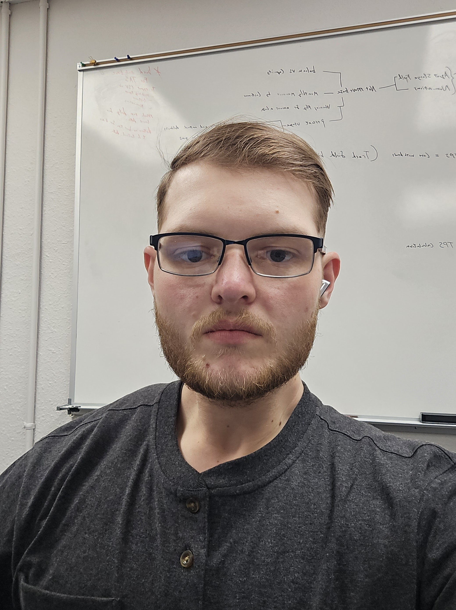

<body>
<h1>Nicholas Steilman</h1>

I am a Software Engineering student at Montana Tech corrently working on my BA with a minor in Computer Science. Currently I am employed at NorthWestern Energy in Butte Montana working as a System Controls\Programing intern where I mainly work with databases and creating small interfaces to complete automated tasks.

  
<h2>Education History</h2>

Montana Tech: Major in Software Engineering (2021-present)

Montana Tech: Minor in Computer Science (2021-present)

Butte High School: Graduated with deploma (2021)

  

<h2>Skills</h2>
<table>
    <tr>
        <th>Skill</th>
        <th>Level</th>
    </tr>
    <tr>
        <th>Python</th>
        <th>Advanced</th>
    </tr>
    <tr>
        <th>Visual Basic</th>
        <th>Advanced</th>
    </tr>
    <tr>
        <th>C++</th>
        <th>Intermidate</th>
    </tr>
    <tr>
        <th>C</th>
        <th>Beginner</th>
    </th>
</table>

  

<h2>Interests</h2>
<ul>
    <li>Robotics</li>
    <li>Hiking</li>
    <li>Hunting</li>
    <li>Fishing</li>
    <li>Sports</li>
</ul>

<h2>Contact Information</h2>
<a href="Nsteilman1@mtech.edu">Nsteilman1@mtech.edu</a>
