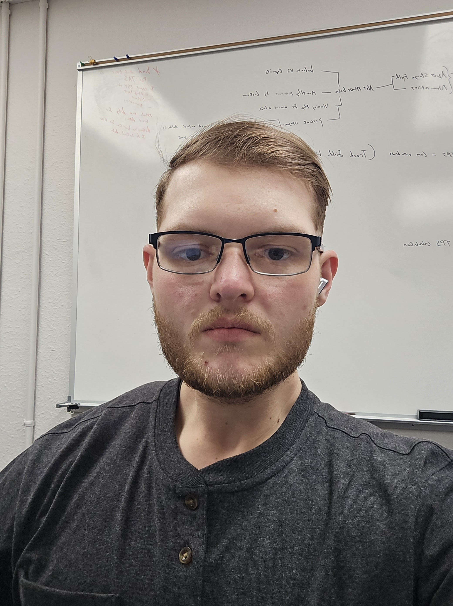

# Nicholas Steilman

I am a Software Engineering student at Montana Tech currently working on my BA with a minor in Computer Science. Currently, I am employed at NorthWestern Energy in Butte, Montana, working as a System Controls/Programming intern where I mainly work with databases and create small interfaces to complete automated tasks.

    

## Education History

- **Montana Tech**: Major in Software Engineering (2021-present)
- **Montana Tech**: Minor in Computer Science (2021-present)
- **Butte High School**: Graduated with diploma (2021)

## Skills

| Skill         | Level       |
|---------------|-------------|
| Python        | Advanced    |
| Visual Basic  | Advanced    |
| C++           | Intermediate|
| C             | Beginner    |

## Interests

- Robotics
- Hiking
- Hunting
- Fishing
- Sports

## Contact Information

[Nsteilman1@mtech.edu](mailto:Nsteilman1@mtech.edu)
